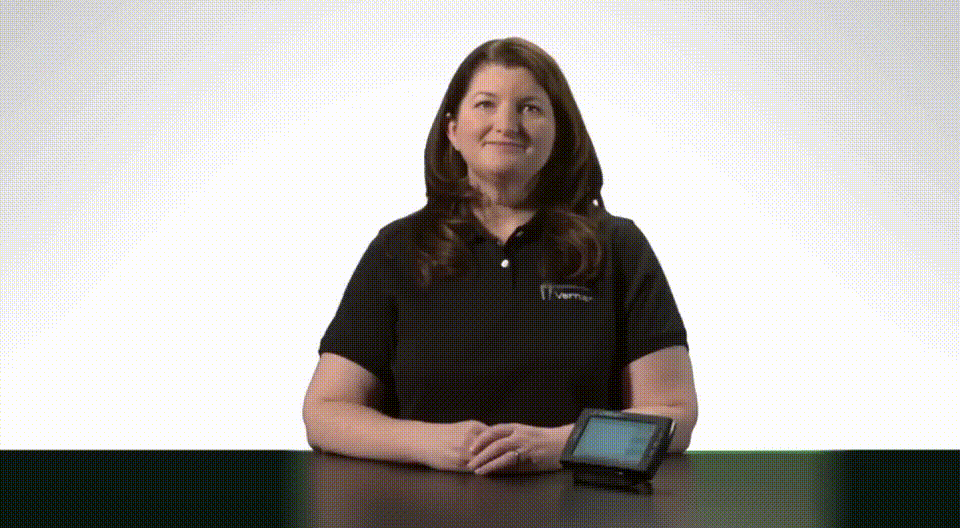

# Human Avatar Generator

**⚠️ Work in Progress**

LTX-Video based training pipeline for generating half-body talking human avatar videos from a given image and text input.

## Overview

This project fine-tunes the [LTX-Video](https://github.com/Lightricks/LTX-Video) model to generate realistic talking avatar videos. Given a single image and text input, the model generates a video of a person speaking with natural facial expressions and head movements.

<div align="center">
  
  <p><i>Example of a generated talking avatar video</i></p>
</div>

## Installation

```bash
git clone https://github.com/lusinlu/Human-Avatar-Generator.git
cd Human-Avatar-Generator

python -m venv env
source env/bin/activate
pip install -r requirements.txt
pip install -e .
```

## Pipeline

### Step 1: Download and Process Videos from AVSpeech Dataset

Download videos from the [AVSpeech dataset](https://looking-to-listen.github.io/avspeech/download.html) and extract relevant segments:

```bash
# Download and process videos from AVSpeech
python video_scraper/scrap_video.py \
    --csv_path video_scraper/avspeech_train.csv \
    --start_row 0 \
    --end_row 1000 \
    --output_dir ./data/raw_videos \
    --transcripts_file ./data/video_transcripts.json
```

**Dataset structure:**
```
data/
├── raw_videos/
│   ├── video_001.mp4
│   ├── video_002.mp4
│   └── ...
├── video_transcripts.json
```

### Step 2: Extract VAE Latents from Videos

Preprocess videos to extract latent representations using the pretrained LTX-Video VAE encoder:

```bash
# Extract video latents
python preprocessing/save_vae_latents.py \
    --inputs ./data/raw_videos \
    --output_dir ./data/vae_latents
```

This will save `.pt` files containing the encoded video latents and `.json` metadata files.

### Step 3: Extract Audio Latents using FaceFormer

Convert text to audio using TTS, then extract audio embeddings using the pretrained FaceFormer model:

```bash
# Extract audio latents
python preprocessing/save_text_latents.py \
    --latents_dir ./data/vae_latents \
    --transcripts ./data/video_transcripts.json \
    --audio_out ./data/audio_wav \
    --ff_out ./data/audio_latents
```

**Complete output structure after all preprocessing:**
```
data/
├── raw_videos/
│   ├── video_001.mp4
│   └── ...
├── video_transcripts.json
├── vae_latents/
│   ├── video_001_0.pt          # VAE latent tensor
│   ├── video_001_0.json        # Metadata (fps, frames, etc.)
│   └── ...
├── audio_wav/
│   ├── video_001_0.wav         # Generated TTS audio
│   └── ...
└── audio_latents/
    ├── video_001_0_ff.npy      # FaceFormer latent embeddings
    ├── video_001_0_text.json   # Text and timing info
    └── ...
```

### Step 4: Train the Model

Train the LTX-Video model with LoRA fine-tuning on cross-attention layers and audio-to-latent projection class:

```bash
cd ltx_video/
# Single GPU training
python training.py --config ../configs/train-avatars.yaml

# Multi-GPU training with DeepSpeed
deepspeed --num_gpus=4 training.py --config ../onfigs/train-avatars.yaml
```

## Inference

Coming soon! Generate talking avatar videos from an image and text:


## Model Architecture

- **Base Model**: LTX-Video 2B Transformer
- **Fine-tuning**: LoRA on cross-attention layers (attn2)
- **Audio Projection**: Custom projection layer to map FaceFormer embeddings to LTX-Video's caption space
- **Training Target**: Velocity prediction in rectified flow framework


## Acknowledgements

- [LTX-Video](https://github.com/Lightricks/LTX-Video) by Lightricks
- [FaceFormer](https://github.com/EvelynFan/FaceFormer) for audio-driven facial animation
- [AVSpeech Dataset](https://looking-to-listen.github.io/avspeech/) for training data

## TODO

- [ ] Complete inference pipeline
- [ ] Add evaluation metrics
- [ ] Real-time inference optimization
- [ ] Web demo interface

## Contact

For questions or issues, please open an issue on GitHub.
